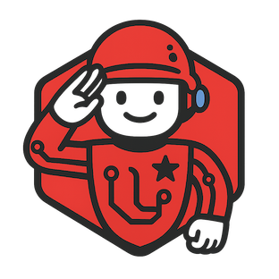

# Laravel Uniformed AI - UNDER DEVELOPMENT - ! DO NOT USE YET ! 


A Laravel package that exposes a single, uniform API over multiple AI providers (OpenAI, OpenRouter, Google AI Studio, KIE.AI, PIAPI.AI, Tavily, ElevenLabs, etc.).


## Features / Goals

- Uniform Contracts for Chat, Images, Audio/Speech, Music, and Web Search.
- Manager + Driver pattern like `filesystem` or `queue`.
- Clean DTOs for all requests/responses.
- Streaming & (future) tool/function calling.
- Retries, rate limiting, caching, consistent error mapping.
- Easily extensible with custom providers.

## Installation

```bash
composer require iserter/laravel-uniformed-ai
```

Publish the config (optional to customize):

```bash
php artisan vendor:publish --tag=uniformed-ai-config
```

Set environment variables for any providers you will use:

```dotenv
OPENAI_API_KEY=...
OPENAI_CHAT_MODEL=gpt-4.1-mini
OPENAI_IMAGE_MODEL=gpt-image-1
OPENROUTER_API_KEY=...
GOOGLE_AI_API_KEY=...
TAVILY_API_KEY=...
ELEVENLABS_API_KEY=...
ELEVENLABS_VOICE_ID=Rachel
```

## Quick Usage

```php
use Iserter\UniformedAI\Facades\AI;
use Iserter\UniformedAI\DTOs\{ChatMessage, ChatRequest, ImageRequest, AudioRequest, SearchQuery};

// Chat
$response = AI::chat()->send(new ChatRequest([
    new ChatMessage('system', 'You are a helpful assistant.'),
    new ChatMessage('user', 'Write a haiku about Laravel.'),
]));

// Streaming
$gen = AI::chat()->stream(new ChatRequest([
    new ChatMessage('user', 'Stream a short poem, token by token.'),
]));
foreach ($gen as $delta) echo $delta;

// Image
$img = AI::image()->create(new ImageRequest(prompt: 'A low-poly fox, 3D, studio light', size: '1024x1024'));
file_put_contents(storage_path('app/fox.png'), base64_decode($img->images[0]['b64']));

// Audio
$tts = AI::audio()->speak(new AudioRequest(text: 'Hello world from Laravel.', voice: 'Rachel', format: 'mp3'));
file_put_contents(storage_path('app/hello.mp3'), base64_decode($tts->b64Audio));

// Search
$results = AI::search()->query(new SearchQuery('Latest on PHP 8.3 features', maxResults: 5));
```

## Extending

```php
app(\Iserter\UniformedAI\Managers\ChatManager::class)->extend('myprovider', function($app) {
    return new \App\AI\Drivers\MyProviderChatDriver(config('services.myprovider'));
});
```

Provide a driver implementing the relevant Contract and map config / responses to the DTOs.

## Testing

Uses Pest + Orchestra Testbench. Fakes HTTP calls via `Http::fake()` for provider payload shape assertions.

```bash
composer test
```

## Roadmap

- Tool calling loop helper.
- JSON / function call modes.
- Multimodal attachments.
- Batching & parallelism helpers.
- Observability (token usage + latency logs).

## License

MIT
